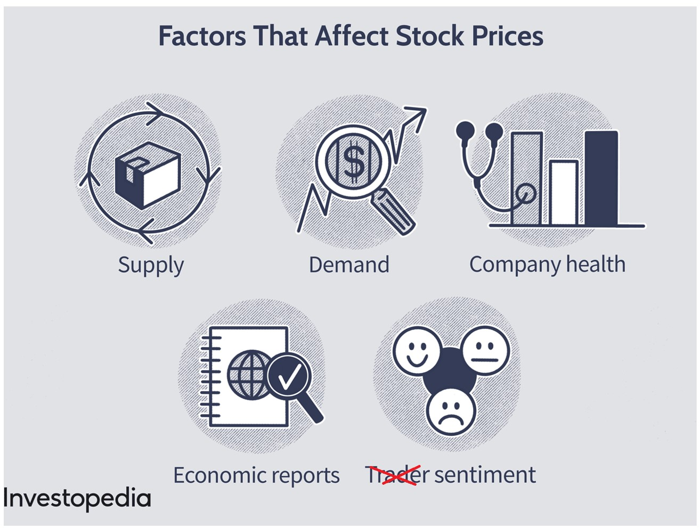
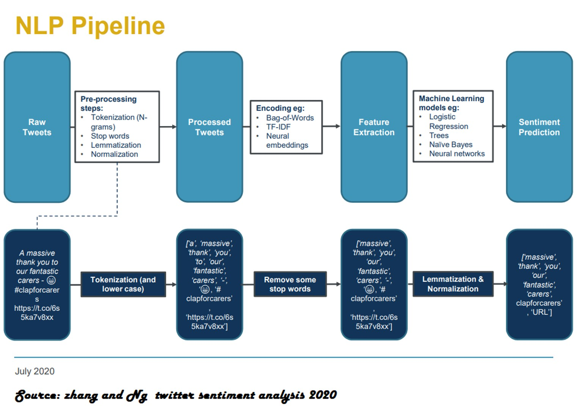
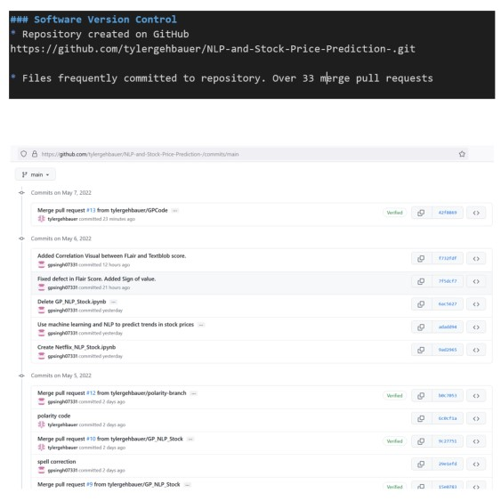
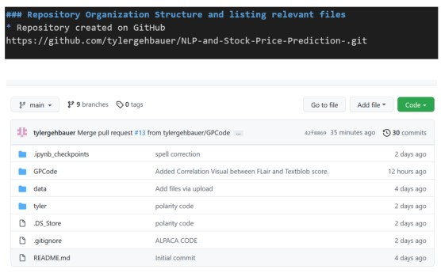
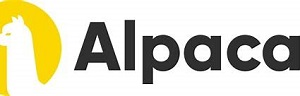
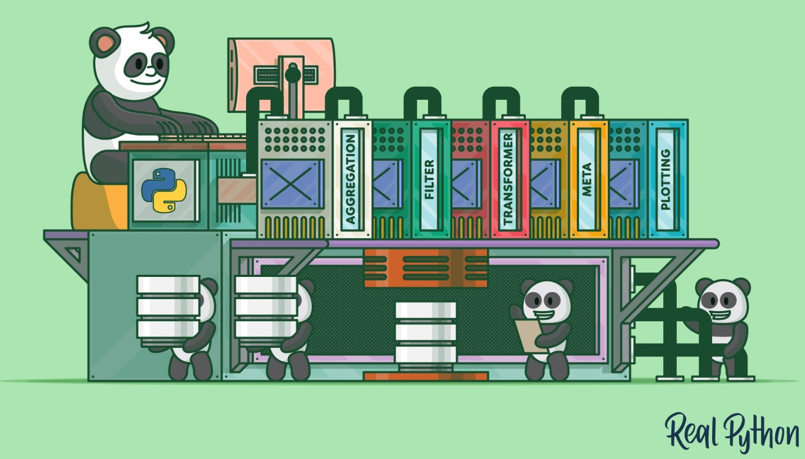
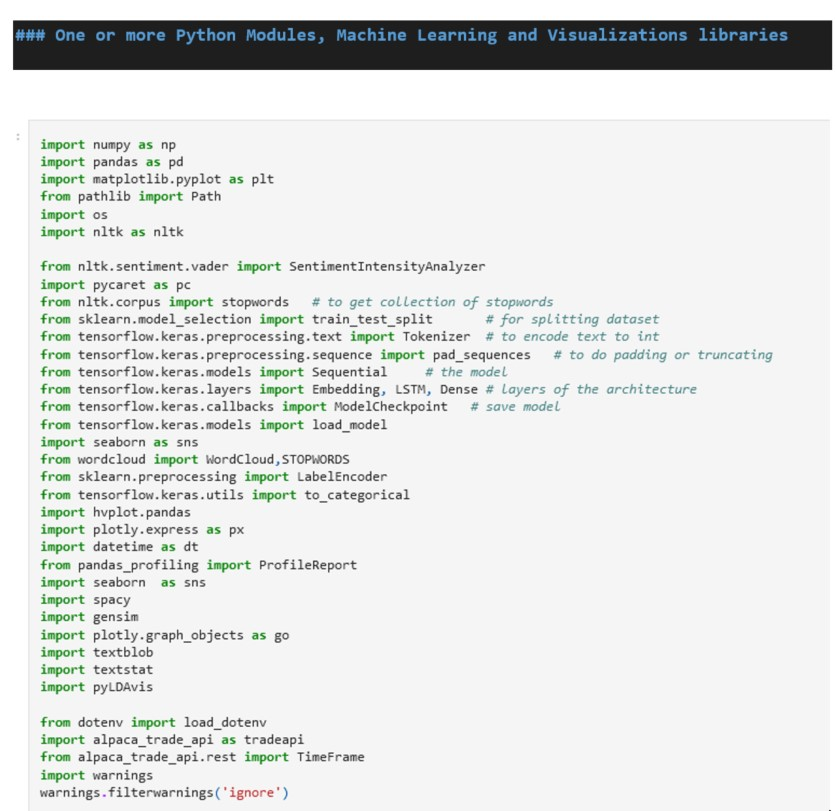
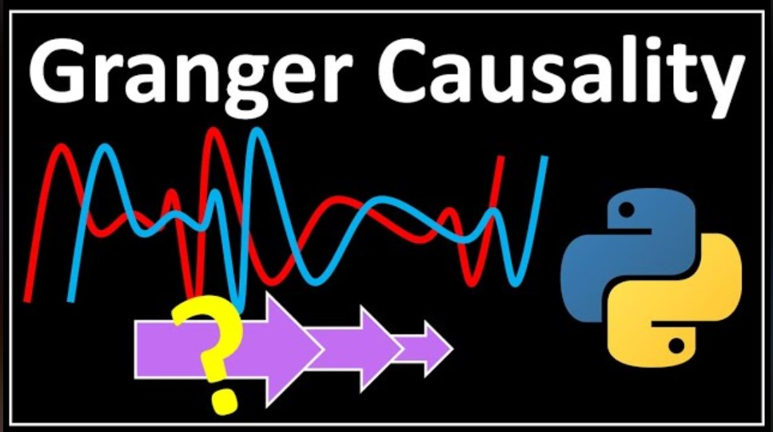

# Capstone Project - Team 3
# Team Members: Singh, Gurpratap (GP), Tyler Gehbauer, Nitty Arora, Nelson Lubinda, Demi Ola

# Project Title: NLP-and-Stock-Price-Prediction

## Using machine learning and NLP to predict trends in stock prices

## Technical Requirements

### Software Version Control 

* Repository created on GitHub
https://github.com/tylergehbauer/NLP-and-Stock-Price-Prediction-.git

* Files frequently committed to repository.
* Committed messages with appropriate level of detail included. 

* Repository organized, and relevant information and project files included. 

### Data Collection and Preparation 

* Data collected, cleaned, and prepared for the application or analysis.
 https://www.kaggle.com/datasets/stefanoleone992/rotten-tomatoes-movies-and-critic-reviews-dataset?select=rotten_tomatoes_movies.csv
 

 * https://app.alpaca.markets/brokerage/dashboard/overview

### Development  

* Jupyter notebook, Notepade, Notepad ++, Visual Studio Code

### One or more Python modules, machine learning models utilized in this project

### Calculations, metrics, visualizations needed to demonstrate the application included. 
* [Evidence Folder](Evidence_Folder/readme.md)

### One new technology or library used that the class hasn't covered. 
* Granger Casuality Test: Combines two data frames for better visualization
* Granger

* Flair
* CIRCLIFY
* Text2Blob

### Presentation 

[Evidence Folder](Evidence_Folder/presentation.ppt)

[Presentation Files on Google Docs](https://drive.google.com/drive/folders/13l0l8TofbhjEogZGwBqDJohKHhWnSzf5?usp=sharing)

### Submission Link on Bootcamp Spot

https://github.com/tylergehbauer/NLP-and-Stock-Price-Prediction-.git

In addition to submitting this project on Bootcamp Spot individually, One member filled out the required form. [--Form to be filled out---](https://forms.gle/CBk5tyy4sSsGN8k38) 

- - -

© 2022 Trilogy Education Services, a 2U, Inc. brand. All Rights Reserved.
