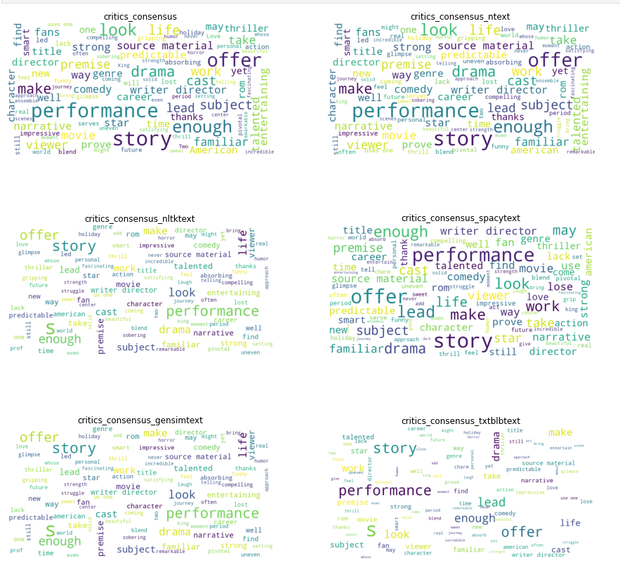

# Capstone Project - Team 3
# Team Members: Singh, Gurpratap (GP), Tyler Gehbauer, Nitty Arora, Nelson Lubinda, Demi Ola

# Project Title: NLP-and-Stock-Price-Prediction

## Using machine learning and NLP to predict trends in stock prices


While the relationship between the sentiment of traders, and sentiment of the digital Twitter population, has been tested to have a relationship to the financial performance of industries, either through share price or financial performance, there has been limited studies of impact of sentiment of Critics review on the stock price of the publishing company.

The purpose of this study is to create a model that is predictive in nature of a publicly traded movie publishing company using sentiment analysis to help determine any directional shift of the share price. Is there a relation between comments made on by movie critic and the sudden change in price seen with the stocks? If so, does the comments have an immediate impact on the stocks, or is there a lag effect where comments made impact the stock a few days later? The project aims to analyze these questions and answer them in an objective manner.

### Methodology:

We have used Pandas heavily in data profiling, pre-processing and plotting.


### Source of Data:

Critic Reviews Dataset :[Rotten Tomatoes movies and critic reviews dataset | Kaggle](https://www.kaggle.com/datasets/stefanoleone992/rotten-tomatoes-movies-and-critic-reviews-dataset)

*Content:*

In the movies dataset each record represents a movie available on Rotten Tomatoes, with the URL used for the scraping, movie tile, description, genres, duration, director, actors, users' ratings, and critics' ratings.
In the critics dataset each record represents a critic review published on Rotten Tomatoes, with the URL used for the scraping, critic name, review publication, date, score, and content.

Publishing Company Stock Data: ALPACA API ( alpaca\_api.get\_bars )

Python Modules Installed:


Other Modules Used:

- Statsmodels (pip install statsmodels)
- Textblob ( pip install textblob)
- Circlify (pip install circlify)
- Flair (pip install flair) May require Pytorch to be installed.
- Gensim (pip install gensim)

### Directory Structure
__________________
```
# Code: Final Jupyter Notebooks
```
[Disney Stock](./Code/Disney_NLP_Stock.ipynb)

[Netflix Stock](./Code/Netflix_NLP_Stock.ipynb)

 
The code has been done for two publishing companies, Netflix and Disney. In the Kaggle data set, any row containing the publishing company name has been included.
________________
````
# /data 
  Data Files used for Movie Critic comments.
`````
[All Data](/data)
___________________
```
# /Presentation:
   Deck for Project presentation
```
[Presentations](/presentation)
___________________
```

# /imgs:
   Images used in Readme and Presentation.

In addition to above team members may have their own branch directory.

```
[All Images](./imgs)
______________________
### Data Profiling:


**Stock Price Profiling:**
```
DIS_DF['Daily Return'] = DIS_DF['close'].pct_change(1)

DIS_DF['Daily Return'].plot(figsize=(20, 20))

```


NLP Pipeline profiling:
```
#Word clouds for each of the Lemmatizer

fig = plt.figure(1, figsize=(15, 15))
for i in range(len(movie_reviews_DIS.columns[movie_reviews_DIS.dtypes==object])):
    ax = fig.add_subplot( int(len(movie_reviews_DIS.columns[movie_reviews_DIS.dtypes==object])/2),2,i+1)
    
    column=movie_reviews_DIS.columns[movie_reviews_DIS.dtypes==object][i]
    
    words = ' '.join(movie_reviews_DIS[column])
    
    wordcloud = WordCloud(
                      background_color='white', 
                      max_words=100,
                      max_font_size=30,
                      scale=3,
                      random_state=1
                     ).generate(words)
    ax.title.set_text(movie_reviews_DIS.columns[movie_reviews_DIS.dtypes==object][i])
    ax.imshow(wordcloud)
    ax.axis('off')
    
```




NLP Score Comparison and Outcome:
```
#Check TextBlob Sentiment score too
#movie_reviews_NFLX['score_txtblob'] = movie_reviews_NFLX['critics_consensus_spacytext'].apply(lambda Text: TextBlob(Text).sentiment)
movie_reviews_NFLX[['score_txtblob','subj_txtblob']] = movie_reviews_NFLX['critics_consensus_spacytext'].apply(lambda Text: pd.Series(TextBlob(Text).
```


**The Final Test:**

We join the movie comment and stock data using Pandas join on streaming\_release\_date (NFLX) and data of Stock price after normalizing the data using MinMaxScaler and plot the final data frame,


The graph does show some promise on probable correlation.

**Granger Causality Test:**


### **Conclusion:**

In the above case P-Value is indeed above 0.05 and hence we can assume that the critic comments do not impact stock value.

We should further test with different publishing company and much bigger dataset.